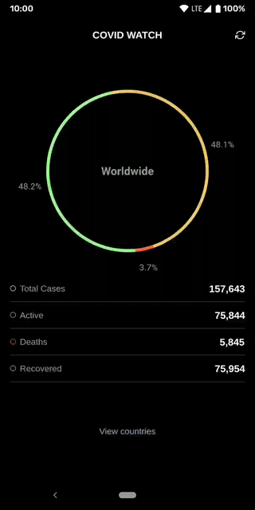

 

COVID Watch is an app which shows the aggregated data of COVID-19 infections, deaths and recoveries worldwide. The app can also show the statistic of each country/territory.

The data is pulled from http://corona.lmao.ninja.

## Releases

Check out the [Releases](https://github.com/shyrwinsia/covid-watch/releases) page.

## Running from Source

### Download Flutter

You can download Flutter from here: [Download Flutter](https://flutter.dev/docs/get-started/install)

Follow the instructions for the setup.

### Install Dependencies

To install the dependencies, use the command:

`flutter pub get`

### Run the App

To run the app, use the command:

`flutter run`

## License

MIT License - [License File](LICENSE)
